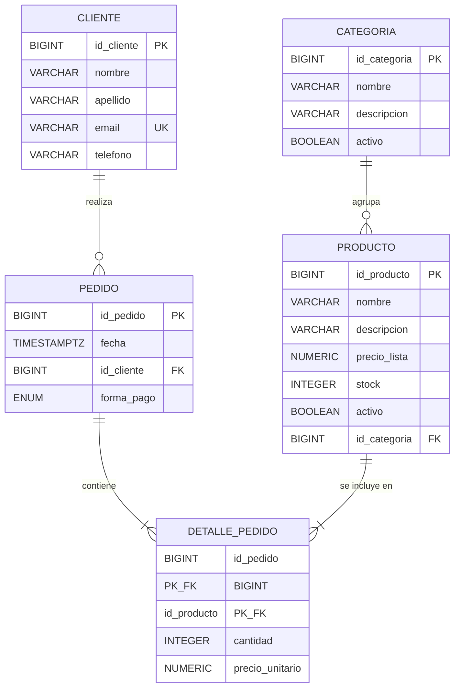

# Modelo Entidad-Relación (ER) — Food Store

Diagrama generado con Mermaid (se renderiza en GitHub). Fuente de verdad: `db/schema.sql`.

## Diagrama ER

## Entidades, atributos y claves

### CLIENTE

| Atributo | Tipo | Clave | Restricción |
|----------|------|-------|-------------|
| `id_cliente` | BIGINT IDENTITY | **PK** | Generada automáticamente |
| `nombre` | VARCHAR(100) | — | NOT NULL |
| `apellido` | VARCHAR(100) | — | NOT NULL |
| `email` | VARCHAR(254) | **UNIQUE (alternativa)** | NOT NULL |
| `telefono` | VARCHAR(30) | — | Nullable (dato opcional) |

Clave candidata alternativa: `email` (identifica de forma única a cada cliente).

### CATEGORIA

| Atributo | Tipo | Clave | Restricción |
|----------|------|-------|-------------|
| `id_categoria` | BIGINT IDENTITY | **PK** | Generada automáticamente |
| `nombre` | VARCHAR(100) | — | NOT NULL |
| `descripcion` | VARCHAR(500) | — | Nullable |
| `activo` | BOOLEAN | — | NOT NULL, DEFAULT TRUE (borrado lógico) |

### PRODUCTO

| Atributo | Tipo | Clave | Restricción |
|----------|------|-------|-------------|
| `id_producto` | BIGINT IDENTITY | **PK** | Generada automáticamente |
| `nombre` | VARCHAR(150) | — | NOT NULL, CHECK no vacío |
| `descripcion` | VARCHAR(500) | — | Nullable |
| `precio_lista` | NUMERIC(12,2) | — | NOT NULL, CHECK > 0 |
| `stock` | INTEGER | — | NOT NULL, DEFAULT 0, CHECK >= 0 |
| `activo` | BOOLEAN | — | NOT NULL, DEFAULT TRUE (borrado lógico) |
| `id_categoria` | BIGINT | **FK** → CATEGORIA | NOT NULL, ON DELETE RESTRICT |

### PEDIDO

| Atributo | Tipo | Clave | Restricción |
|----------|------|-------|-------------|
| `id_pedido` | BIGINT IDENTITY | **PK** | Generada automáticamente |
| `fecha` | TIMESTAMPTZ | — | NOT NULL, DEFAULT NOW() |
| `id_cliente` | BIGINT | **FK** → CLIENTE | NOT NULL, ON DELETE RESTRICT |
| `forma_pago` | forma_pago_enum | — | NOT NULL (EFECTIVO, TARJETA, TRANSFERENCIA) |

### DETALLE_PEDIDO (entidad débil / asociativa)

| Atributo | Tipo | Clave | Restricción |
|----------|------|-------|-------------|
| `id_pedido` | BIGINT | **PK compuesta** + FK → PEDIDO | NOT NULL, ON DELETE RESTRICT |
| `id_producto` | BIGINT | **PK compuesta** + FK → PRODUCTO | NOT NULL, ON DELETE RESTRICT |
| `cantidad` | INTEGER | — | NOT NULL, CHECK > 0 |
| `precio_unitario` | NUMERIC(12,2) | — | NOT NULL, CHECK > 0 |

No tiene atributo propio de identificación: su identidad la define la pareja
`(id_pedido, id_producto)`. Es una entidad asociativa resuelta como tabla.

## Cardinalidades

| Relación | Entidad A | Entidad B | Cardinalidad | Lectura |
|----------|-----------|-----------|--------------|---------|
| Realiza | CLIENTE | PEDIDO | **1 : N** | Un cliente realiza muchos pedidos; un pedido pertenece a un solo cliente |
| Agrupa | CATEGORIA | PRODUCTO | **1 : N** | Una categoría agrupa muchos productos; un producto pertenece a una sola categoría |
| Contiene | PEDIDO | DETALLE_PEDIDO | **1 : N** | Un pedido contiene muchos detalles; un detalle pertenece a un solo pedido |
| Se incluye en | PRODUCTO | DETALLE_PEDIDO | **1 : N** | Un producto aparece en muchos detalles; un detalle referencia un solo producto |
| (Implícita) PEDIDO ↔ PRODUCTO | — | — | **N : M** | Resuelta por la intermedia DETALLE_PEDIDO |

## Participación

| Relación | Lado A | Participación de A | Justificación |
|----------|--------|--------------------|---------------|
| CLIENTE → PEDIDO | Cliente | **Parcial** | Un cliente puede existir sin haber realizado ningún pedido (no hay restricción que obligue a tener pedidos) |
| CATEGORIA → PRODUCTO | Categoría | **Parcial** | Una categoría puede existir sin productos asociados |
| PRODUCTO → CATEGORIA | Producto | **Total** | `id_categoria NOT NULL`: todo producto debe tener una categoría asignada |
| PEDIDO → CLIENTE | Pedido | **Total** | `id_cliente NOT NULL`: todo pedido debe tener un cliente |
| PEDIDO → DETALLE_PEDIDO | Pedido | **Total (de negocio)** | Un pedido sin líneas no tiene sentido comercial; la FK está en el lado del detalle, por lo que el esquema no lo impide a nivel físico, pero la regla de negocio exige al menos un detalle |
| PRODUCTO → DETALLE_PEDIDO | Producto | **Parcial** | Un producto puede existir sin haberse vendido nunca |

## Nota sobre entidad débil

`DETALLE_PEDIDO` es una **entidad asociativa** (también llamada de unión) que
resuelve la relación N:M entre `PEDIDO` y `PRODUCTO`. No existe sin sus
entidades padres: si se elimina el pedido o el producto, el detalle deja de
tener significado (por eso ambas FK son `ON DELETE RESTRICT`).
